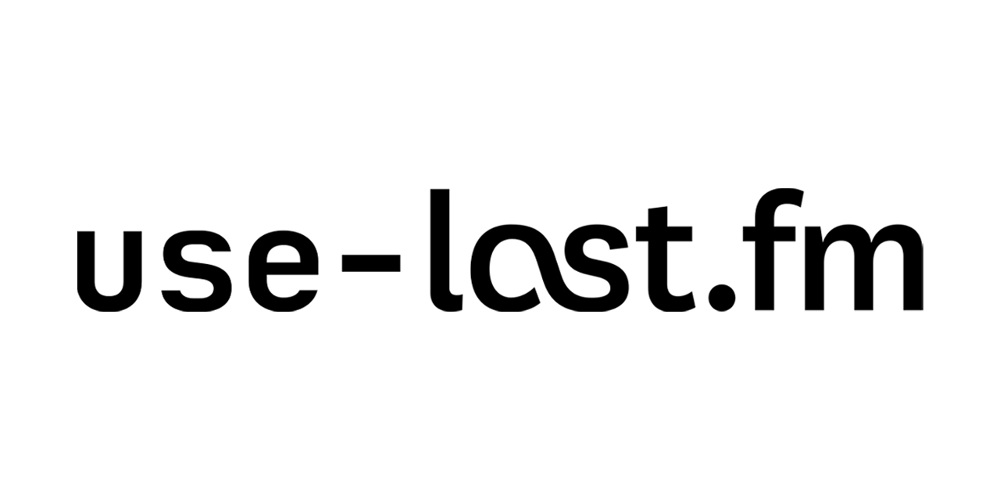

Stream your currently playing song through last.fm as a React hook.

# Features

- 📦 **Tiny**: `use-last-fm` weighs in at **less than** 700 bytes minified and gzipped.
- 🌳 **Universal**: we dist esm and cjs modules.
- 👨‍💻 **Developer friendly**: Helpful development messages that are stripped away in production
- ⌨️ **Strongly typed**: `use-last-fm` is written in TypeScript and encourages good practices this way

## Installation

##### With NPM

> `npm i --save use-last-fm`

##### Or, with yarn:

> `yarn add use-last-fm`

## Usage

```tsx
import { useLastFM } from 'use-last-fm';

const CurrentlyPlaying = () => {
  const lastFM = useLastFM('aabbccsmith', '[add api token here]');

  if (lastFM.status !== 'playing') {
    return <p>Not listening to anything</p>;
  }

  return (
    <p>
      Listening to {lastFM.song.name} by {lastFM.song.artist}
    </p>
  );
};
```

A full example can be seen in the [examples](https://github.com/webmail/use-last-fm/tree/master/example) folder
